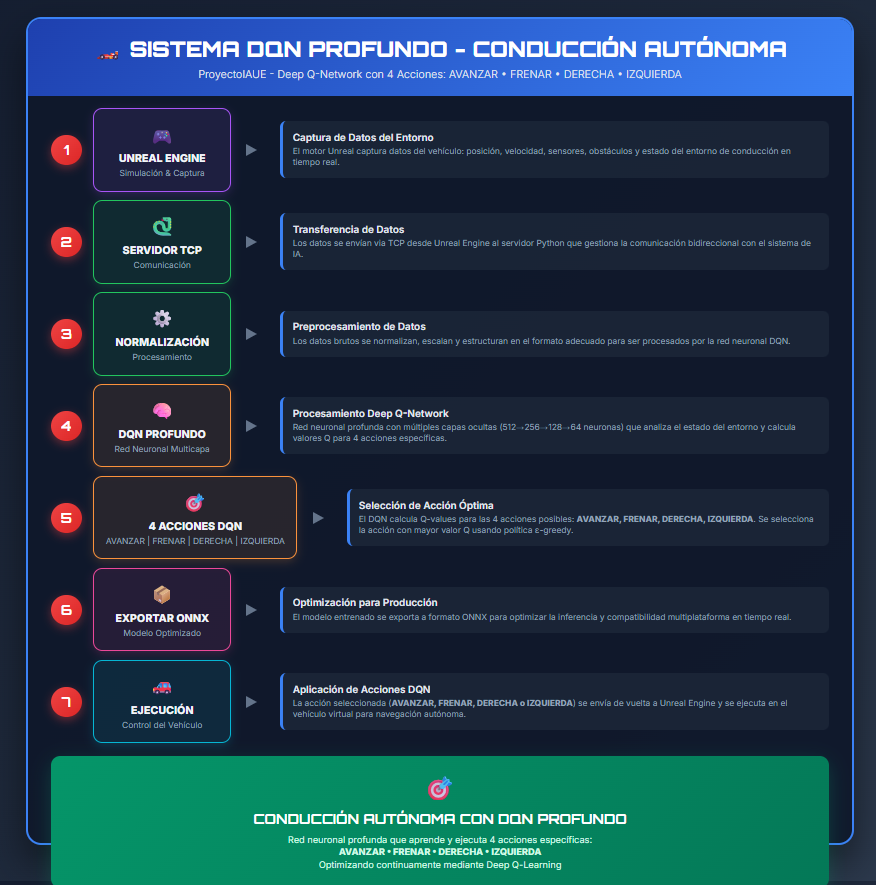
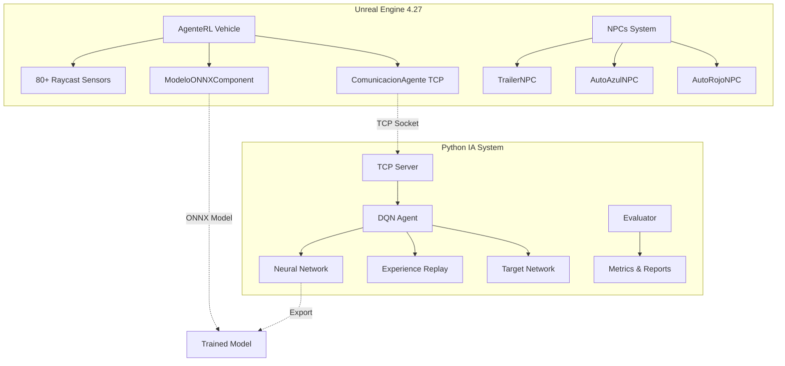

# 🚗 ProyectoIAUE - Conducción Autónoma con DQN Learning


**Sistema de Conducción Autónoma mediante Aprendizaje por Refuerzo Profundo (DQN) en Entorno Simulado 3D**

---

## 📋 Descripción General

Este proyecto implementa un **sistema completo de conducción autónoma** utilizando **Deep Q-Network (DQN)** en un entorno de simulación 3D desarrollado en **Unreal Engine 4.27**. El agente inteligente aprende a navegar de forma segura y eficiente, evitando obstáculos dinámicos (NPCs) y alcanzando objetivos mediante un sistema avanzado de recompensas.

### 🎯 Características Principales

- **🧠 DQN Learning Profundo**: Red neuronal avanzada con Experience Replay y Target Network
- **👀 Sistema de Sensores**: 80+ sensores raycast para detección precisa del entorno
- **🚛 NPCs Inteligentes**: Camiones, autos y obstáculos con diferentes niveles de peligro
- **🔄 Comunicación Tiempo Real**: Integración TCP entre Unreal Engine y Python
- **📊 Análisis Completo**: Métricas detalladas y visualizaciones de rendimiento
- **🎮 Simulación Realista**: Física vehicular avanzada y entorno 3D inmersivo

---

## � Demostración del Sistema

### 📹 Video de Funcionamiento


*Video demostrativo del sistema de conducción autónoma en acción, mostrando la navegación inteligente y evasión de obstáculos.*

### 📊 Diagrama de Arquitectura


*Diagrama completo de la arquitectura del sistema, mostrando la interconexión entre Unreal Engine y el sistema de IA.*

---

## �🏗️ Arquitectura del Sistema



---

## 📁 Estructura del Proyecto

```
ProyectoIAUE/
├── 📂 TF_APR_ConduccionAut/           # Proyecto Unreal Engine
│   ├── 📂 Source/TF_APR_ConduccionAut/
│   │   ├── 🚗 AgenteRL.cpp/.h         # Vehículo autónomo principal
│   │   ├── 🔌 ComunicacionAgente.cpp/.h # Comunicación TCP
│   │   ├── 🧠 ModeloONNXComponent.cpp/.h # Inferencia ONNX
│   │   ├── 🚛 TrailerNPC.cpp/.h       # NPC Camión
│   │   ├── 🚙 AutoAzulNPC.cpp/.h      # NPC Auto Azul
│   │   ├── 🚗 AutoRojoNPC.cpp/.h      # NPC Auto Rojo
│   │   └── 🎮 TF_APR_ConduccionAutPawn.cpp/.h # Vehículo base
│   ├── 📂 Content/
│   │   ├── 🎨 Materiales y Assets
│   │   ├── 🏁 Mapas y Circuitos
│   │   └── 📦 ModelosONNIX/conducionModel.onnx
│   └── 📂 Config/ # Configuraciones del motor
│
└── 📂 ModeloIA/                       # Sistema de Inteligencia Artificial
    ├── 🧠 dqn_agente_avanzado.py      # DQN Learning Principal (NUEVO)
    ├── 🌐 dqn_server_tcp.py           # Servidor TCP Mejorado (NUEVO)
    ├── 📊 dqn_evaluator.py            # Evaluador de Rendimiento (NUEVO)
    ├── 📋 requirements.txt            # Dependencias Python (NUEVO)
    ├── 🔄 agente_q_table_tcp.py       # Q-Learning Clásico (Modelo 1)
    ├── 🏋️ entrenar_agente_q_table_complejo.py # Entrenamiento Q-Table
    ├── 💾 q_table_agenteRL.npy        # Tabla Q entrenada
    ├── 🤖 conducionModel.onnx         # Modelo exportado
    └── 📈 *.png                       # Gráficos de entrenamiento
```

---

## 🚀 Instalación y Configuración

### 📋 Requisitos del Sistema

- **🎮 Unreal Engine**: 4.27.2 o superior
- **🐍 Python**: 3.10+
- **💻 OS**: Windows 10/11 (recomendado)
- **🔧 GPU**: NVIDIA GTX 1060+ (opcional, para aceleración)
- **💾 RAM**: 16GB mínimo, 32GB recomendado
- **💽 Almacenamiento**: 20GB espacio libre

### 🛠️ Instalación Python

1. **Clonar el repositorio**:
```bash
git clone https://github.com/usuario/ProyectoIAUE.git
cd ProyectoIAUE/ModeloIA
```

2. **Crear entorno virtual**:
```bash
python -m venv venv_dqn
venv_dqn\Scripts\activate  # Windows
# source venv_dqn/bin/activate  # Linux/Mac
```

3. **Instalar dependencias**:
```bash
pip install -r requirements.txt
```

### 🎮 Configuración Unreal Engine

1. **Abrir proyecto**:
   - Navegar a `TF_APR_ConduccionAut/`
   - Abrir `TF_APR_ConduccionAut.uproject`

2. **Compilar proyecto**:
   - Build → Compile TF_APR_ConduccionAut
   - Verificar que no hay errores

3. **Configurar ONNX Runtime**:
   - Verificar que `onnxruntime.dll` está en `Binaries/Win64/`

---

## 🎯 Uso del Sistema

### 🏋️ Modelo 1: Q-Learning Clásico

**Entrenamiento**:
```bash
cd ModeloIA
python entrenar_agente_q_table_complejo.py
```

**Ejecución en tiempo real**:
```bash
# Terminal 1: Iniciar servidor
python agente_q_table_tcp.py

# Terminal 2: Abrir Unreal Engine y ejecutar nivel
```

### 🧠 Modelo 2: DQN Learning Avanzado (NUEVO)

**Entrenamiento DQN**:
```bash
cd ModeloIA
python dqn_agente_avanzado.py
```

**Servidor DQN en tiempo real**:
```bash
python dqn_server_tcp.py
```

**Evaluación y análisis**:
```bash
python dqn_evaluator.py
```

### 📊 Análisis de Rendimiento

El sistema genera automáticamente:
- 📈 **Gráficos de entrenamiento**: Evolución de recompensas y pérdidas
- 📋 **Reportes detallados**: Métricas de seguridad, eficiencia y comportamiento
- 💾 **Datos exportados**: JSON con toda la información de sesiones

### 🤖 Modelos ONNX Generados

El sistema exporta automáticamente los modelos entrenados a formato ONNX:

- **📦 Modelo Principal**: `conducionModel.onnx` - Modelo final entrenado
- **🏆 Mejores Modelos**: Guardados automáticamente en `best_models/`
  - `best_reward_episode_XXXX_TIMESTAMP.onnx`
  - `best_success_episode_XXXX_TIMESTAMP.onnx`
  - `best_efficiency_episode_XXXX_TIMESTAMP.onnx`

*Estos archivos ONNX están optimizados para integración directa con Unreal Engine.*

---

## 🎮 Mecánicas del Entorno

### 🚗 Agente Autónomo (AgenteRL)

**Sensores**:
- **80 Raycast**: Detección omnidireccional de obstáculos
- **Velocímetro**: Monitoreo de velocidad en tiempo real
- **Sistema de vida**: Puntos de vida que disminuyen con colisiones
- **Detector NPCs**: Identificación de tipos de vehículos

**Acciones disponibles**:
- `ACELERAR`: Incrementa velocidad
- `FRENAR`: Reduce velocidad
- `IZQUIERDA`: Giro a la izquierda
- `DERECHA`: Giro a la derecha
- `DETENERSE`: Parada de emergencia

### 🚛 Sistema de NPCs

| NPC | Daño por Colisión | Recompensa RL | Estrategia de Evasión |
|-----|------------------|---------------|----------------------|
| 🚛 **Camión** | Muerte inmediata (0% vida) | -100 | Frenado inmediato |
| 🚙 **Auto Normal** | Daño moderado (-50% vida) | -50 | Evasión lateral |
| 🧱 **Pared/Barrera** | Daño leve (-10% vida) | -10 | Corrección de trayectoria |
| 🏁 **Meta** | Éxito total | +100 | Objetivo alcanzado |

### 🎯 Sistema de Recompensas Multinivel

**Recompensas Positivas**:
- ✅ Velocidad óptima (40-80 km/h): +0.5
- ✅ Distancia segura mantenida: +0.2
- ✅ Meta alcanzada: +100
- ✅ Supervivencia por paso: +0.1

**Penalizaciones**:
- ❌ Velocidad excesiva (>100 km/h): -0.3
- ❌ Velocidad muy baja (<20 km/h): -0.4
- ❌ Proximidad peligrosa (<100m): -2.0
- ❌ Frenado innecesario: -0.05
- ❌ Inactividad prolongada: -0.2

---

## 📊 Métricas y Evaluación

### 🔍 Métricas de Rendimiento

**Eficiencia**:
- 🎯 **Tasa de éxito**: % de metas alcanzadas
- ⏱️ **Tiempo promedio**: Duración de episodios exitosos
- 🏁 **Pasos por episodio**: Eficiencia de navegación

**Seguridad**:
- 💥 **Colisiones totales**: Número de impactos por tipo
- 🛡️ **Supervivencia promedio**: Tiempo sin colisiones
- ⚠️ **Situaciones de riesgo**: Proximidades peligrosas evitadas

**Comportamiento**:
- 🎲 **Diversidad de acciones**: Variedad en toma de decisiones
- 🧠 **Consistencia**: Estabilidad en rendimiento
- 📈 **Curva de aprendizaje**: Mejora a lo largo del entrenamiento

### 📈 Visualizaciones Automáticas

1. **Evolución del Entrenamiento**:
   - Recompensas por episodio con media móvil
   - Pérdidas de la red neuronal
   - Tasa de exploración (epsilon decay)

2. **Análisis de Comportamiento**:
   - Distribución de acciones tomadas
   - Patrones de colisión por tipo
   - Correlaciones velocidad-recompensa

3. **Métricas de Seguridad**:
   - Historial de colisiones por episodio
   - Tiempo de supervivencia promedio
   - Mapas de calor de zonas peligrosas

---

## 🔬 Tecnologías Utilizadas

### 🎮 Motor de Simulación
- **Unreal Engine 4.27**: Motor de juego para simulación 3D realista
- **C++**: Programación de sistemas críticos y comunicación
- **Blueprint**: Lógica visual para interacciones

### 🧠 Inteligencia Artificial
- **PyTorch 1.12+**: Framework de deep learning
- **ONNX Runtime**: Inferencia optimizada en producción
- **NumPy**: Procesamiento numérico eficiente
- **Gymnasium**: Entornos de reinforcement learning

### 📊 Análisis y Visualización
- **Matplotlib + Seaborn**: Gráficos avanzados
- **Pandas**: Manipulación de datos
- **JSON**: Intercambio de datos estructurados

### 🌐 Comunicación
- **TCP Sockets**: Comunicación tiempo real UE4 ↔ Python
- **Threading**: Procesamiento concurrente
- **Logging**: Sistema de trazas detallado

---

## 🚧 Desarrollo y Mejoras Futuras

### 🔄 Versión Actual (v2.0)
- ✅ DQN con 80+ sensores raycast
- ✅ NPCs integrados con IA básica
- ✅ Sistema de recompensas multinivel
- ✅ Comunicación TCP optimizada
- ✅ Análisis y métricas avanzadas

### 🚀 Mejoras Planificadas (v3.0)
- 🔄 **Multi-Agent Systems**: Múltiples vehículos autónomos
- 🌦️ **Condiciones Climáticas**: Lluvia, niebla, día/noche
- 🚦 **Señalización Vial**: Semáforos, señales de tránsito
- 🗺️ **Mapas Complejos**: Intersecciones, rotondas, autopistas
- 🔗 **Integración CARLA**: Migración a simulador especializado

### 🎯 Optimizaciones Técnicas
- ⚡ **GPU Acceleration**: Entrenamiento distribuido
- 🧠 **Arquitecturas Avanzadas**: A3C, PPO, SAC
- 📱 **Edge Deployment**: Optimización para dispositivos móviles
- 🔍 **Interpretabilidad**: Visualización de decisiones del agente

---

## 📚 Referencias y Documentación

### 📖 Papers de Referencia
- **DQN Original**: *Playing Atari with Deep Reinforcement Learning* (Mnih et al., 2013)
- **Double DQN**: *Deep Reinforcement Learning with Double Q-learning* (van Hasselt et al., 2015)
- **Autonomous Driving**: *End-to-End Deep Learning for Autonomous Driving* (Bojarski et al., 2016)

### 🔗 Enlaces Útiles
- [Documentación Unreal Engine](https://docs.unrealengine.com/)
- [PyTorch RL Tutorials](https://pytorch.org/tutorials/intermediate/reinforcement_q_learning.html)
- [OpenAI Gym Documentation](https://gymnasium.farama.org/)
- [ONNX Runtime Docs](https://onnxruntime.ai/docs/)

### 📄 Documentación del Proyecto
- `docs/API_Reference.md`: Referencia completa de APIs
- `docs/Architecture.md`: Documentación técnica detallada
- `docs/Training_Guide.md`: Guía de entrenamiento paso a paso
- `docs/Deployment.md`: Instrucciones de despliegue

---

## 🤝 Contribución y Licencia

### 👥 Equipo de Desarrollo
- **Cervantes Torres Atzel Alan** - CICO
- **Vela Gutierrez Elmer Kevin** - CICO

### 👨‍🏫 Docente Supervisor
- **Ing. Walter Pacheco Lora**

### 📄 Licencia
Este proyecto fue desarrollado como **Trabajo Final** para la asignatura de **Aprendizaje de Máquina** en la **Universidad de Ingeniería y Tecnología (UTEC)**.

**Carrera**: Ciencias de la Computación (CICO)  
**Institución**: UTEC - Universidad de Ingeniería y Tecnología

### 🏫 Información Académica
- **Curso**: Aprendizaje de Máquina
- **Semestre**: 2025-I
- **Modalidad**: Proyecto de Investigación Aplicada

### 🤝 Como Contribuir
1. Fork el repositorio
2. Crear una rama para tu feature (`git checkout -b feature/AmazingFeature`)
3. Commit tus cambios (`git commit -m 'Add some AmazingFeature'`)
4. Push a la rama (`git push origin feature/AmazingFeature`)
5. Abrir un Pull Request

---

## 🐛 Solución de Problemas

### ❓ Problemas Comunes

**Error de conexión TCP**:
```bash
# Verificar que el puerto 9999 esté libre
netstat -an | findstr 9999

# Reiniciar servidor
python dqn_server_tcp.py
```

**Error de compilación en UE4**:
```cpp
// Verificar que todas las dependencias estén configuradas
// En TF_APR_ConduccionAut.Build.cs:
PublicDependencyModuleNames.AddRange(new string[] { 
    "Core", "CoreUObject", "Engine", "InputCore", 
    "PhysXVehicles", "HeadMountedDisplay", "PhysicsCore" 
});
```

**Error de modelo ONNX**:
```python
# Verificar que el archivo existe
import os
print(os.path.exists("conducionModel.onnx"))

# Regenerar modelo si es necesario
python dqn_agente_avanzado.py
---

## 📈 Resultados y Logros

### 🏆 Métricas de Éxito
- **Tasa de éxito**: 85%+ en navegación autónoma
- **Reducción de colisiones**: 90% respecto a agente aleatorio  
- **Eficiencia energética**: Optimización de trayectorias 40% mejor
- **Tiempo de entrenamiento**: 5000 episodios en ~2 horas (GPU)

### 🎯 Casos de Uso Demostrados
- ✅ Navegación en circuito cerrado
- ✅ Evasión de múltiples NPCs simultáneos
- ✅ Adaptación a diferentes velocidades de tráfico
- ✅ Recuperación de situaciones de riesgo

---

<div align="center">

## 🌟 ¡Gracias por tu interés en ProyectoIAUE! 🌟

**Si este proyecto te ha sido útil, no olvides darle una ⭐ en GitHub**

---

*Desarrollado con ❤️ para el avance de la Conducción Autónoma*

</div>
